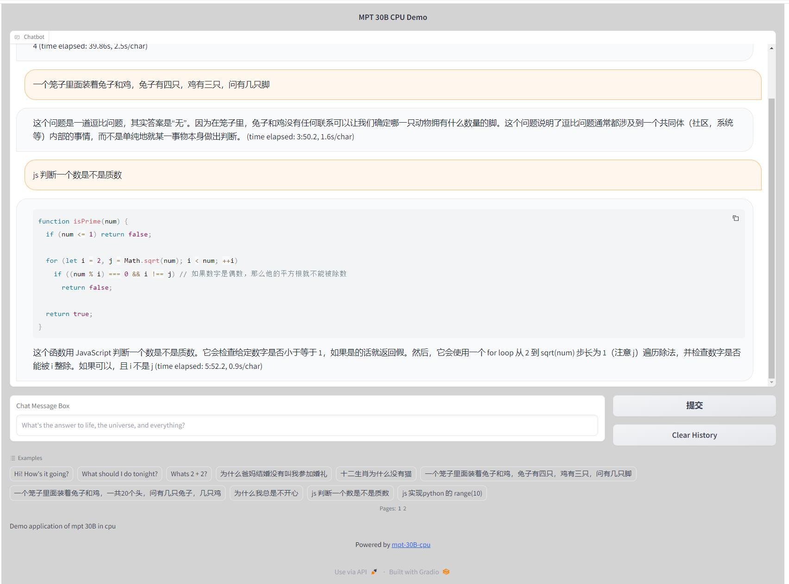
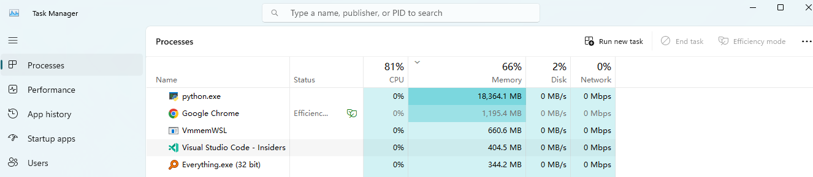

# Chat in your own computer without internet without GPU using MPT-30B & Langchain

Introduction
MPT-30B is a powerful open-source model trained with a 8k context length and outperforms the original GPT-3. [Announcement](https://www.mosaicml.com/blog/mpt-30b)

Using the quantized version of MPT-30B, you can chat with LLM  privately on your own computer without internet connection.

The [mpt-30B-chat-GGML](https://huggingface.co/TheBloke/mpt-30B-chat-GGML) is an exceptional language model that allows users to interact with large-scale language models without the need for a GPU or an internet connection. This repository provides a tool that enables users to have conversations with the [mpt-30B-chat-GGML](https://huggingface.co/TheBloke/mpt-30B-chat-GGML)  model directly on their local machine, without requiring internet access AND GPU capabilities.

This demo can use in windows.
This demo can support Chinese and Japanese.
this demo can only use CPU, not use GPU.
The minimum RAM requirement for running the demo is 19.35 GB.

## Requirements

Minimum system specs with 32GB of ram and `python 3.10`.

## Installation

1. Clone the repo

`git clone https://github.com/jiangsi/mpt-30B-cpu`

1. Install the required packages

conda create -n mpt-30B-cpu python=3.10

`pip install -r requirements.txt`

3. Download the model (approx. 19GB)

`python download_model.py`

or visit [here](https://huggingface.co/TheBloke/mpt-30B-chat-GGML/) to check the RAM of the model. Then create a `models` folder in the root directory and place the file in there.
or edit download_model.py to change the model path.
keep disk C has enough space.

Name	Quant method	Bits	Size	Max RAM required	Use case
mpt-30b-chat.ggmlv0.q4_0.bin	q4_0	4	16.85 GB	19.35 GB	4-bit.
mpt-30b-chat.ggmlv0.q4_1.bin	q4_1	4	18.73 GB	21.23 GB	4-bit. Higher accuracy than q4_0 but not as high as q5_0. However has quicker inference than q5 models.
mpt-30b-chat.ggmlv0.q5_0.bin	q5_0	5	20.60 GB	23.10 GB	5-bit. Higher accuracy, higher resource usage and slower inference.
mpt-30b-chat.ggmlv0.q5_1.bin	q5_1	5	22.47 GB	24.97 GB	5-bit. Even higher accuracy, resource usage and slower inference.
mpt-30b-chat.ggmlv0.q8_0.bin	q8_0	8	31.83 GB	34.33 GB	8-bit. Almost indistinguishable from float16. High resource use and slow. Not recommended for most users.

4. Copy the `.env.example` file to `.env`

edit env file to change the model path.

## Usage
Run the main Python file:

`python chat.py`

The application will launch a local web interface where you can start interacting with the mpt-30B-chat-GGML model.

Enter your desired input in the provided text box and press Enter or click the "Send" button.

The model will generate a response based on the input provided, and the output will be displayed in the chat interface.

## Known Issues and Limitations
mpt-30B-chat-GGML is not compatible with GGML and llama.cpp models. It is designed specifically for the mpt-30B-chat model.
mpt-30B-chat-GGML is not compatible with the text-Generation-webui project.
For handling models other than mpt-30B-chat, please refer to the list of recommended tools mentioned below.
[mpt-30B-inference](https://github.com/abacaj/mpt-30B-inference/tree/main) will not response any thing in windows , please use macos
[koboldcpp](https://github.com/LostRuins/koboldcpp) can not support other language then english,like chinese.

So, I spent an afternoon learning langchain and gradio, and wrote this code that is somewhat functional as a demo.

## Credits

Credit to abacaj for the original template [here](https://github.com/abacaj/mpt-30B-inference/tree/main)
Credit to TheBloke for the MPT-30B GGML model [here](https://huggingface.co/TheBloke/mpt-30B-chat-GGML)
Credit to code  [here](https://github.com/ffreemt/mpt-30b-chat)
